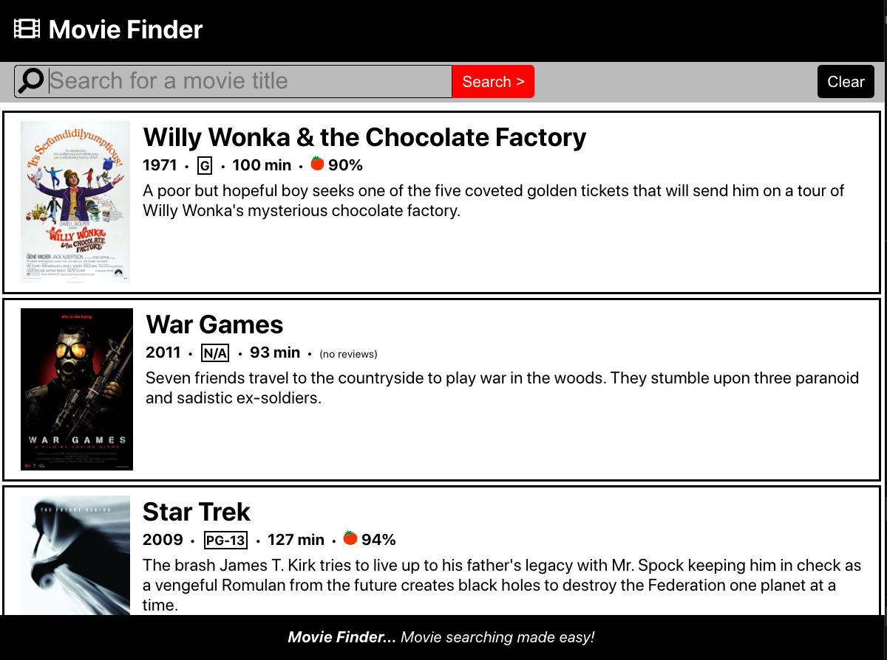

# Movie Finder - A demo React application



Movie Finder is a demo React application that allows you to search for your favorite movies and get details about it, including its Rotten Tomatoes score.

## Local Deployment

You can deploy your own instance of Movie Finder by following the below instructions.

## Obtain Open Movie Database API Key

Movie Finder relies on the Open Movie Database API. In order to run Movie Finder you will need to acquire your own Open Movie Database API key. This is a quick and easy process that begins be filling out the registration at the below link. The FREE key will suffice for most users.

Get your OMDB Key: http://www.omdbapi.com/apikey.aspx

After completing the form, Open Movie Database will email you your own API key.

## Clone Movie Finder

Next, clone a copy of the Movie Finder project to your local computer. In a terminal window change to the directory where you would like to store Movie Finder and enter the following command.

```
git clone https://github.com/danniegregoire/MovieFinder
```

## Set Your OMDB Key

For security, Movie Finder relies on the Open Movie API key being installed as an environment variable. To set the environment variable, enter the following into your terminal, placing your own API key within the quotes.

```
export MFA_OMDB_KEY="<YOUR_API_KEY>"
```

## Start the Movie Finder Server

Within this same terminal change into the 'server' directory within the Movie Finder project. Start the Movie Finder API server by entering the following command.

```
npm install
npm start
```

## Start the Movie Finder Client

Finally, start your local instance of the Movie Finder client. Open a new termainal and change into the 'client' directory of the Movie Finder project. Start the Movie Finder client by entering the following command:

```
npm install
npm start
```

## Using Movie Finder

You can now use your local instance of Movie Finder by visiting the following url within your web browser.

```
http://localhost:3000
```

Once Movie Finder loads, you can begin your quest to find your next great movie to watch by entering a title into the search field. To clear the result list, simply press the 'Clear' button.
